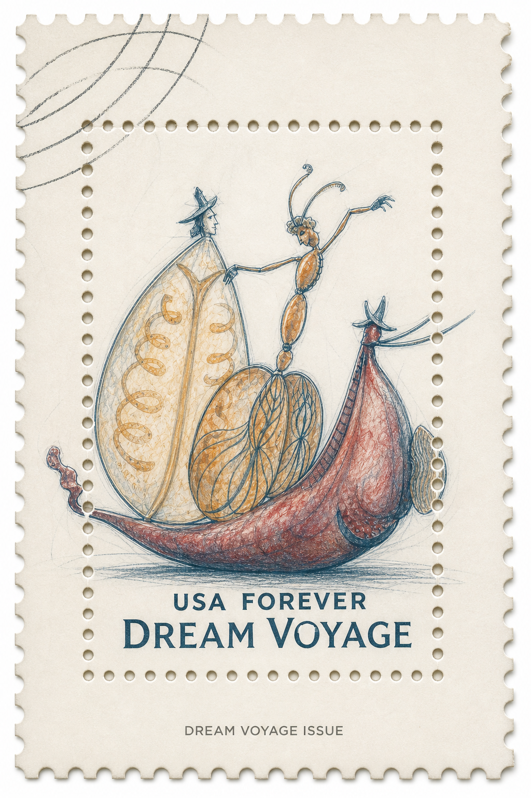
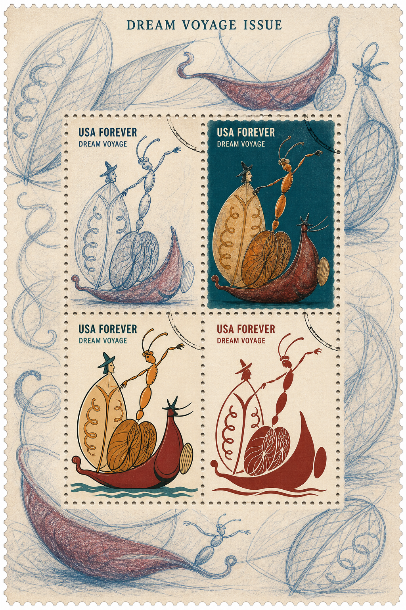
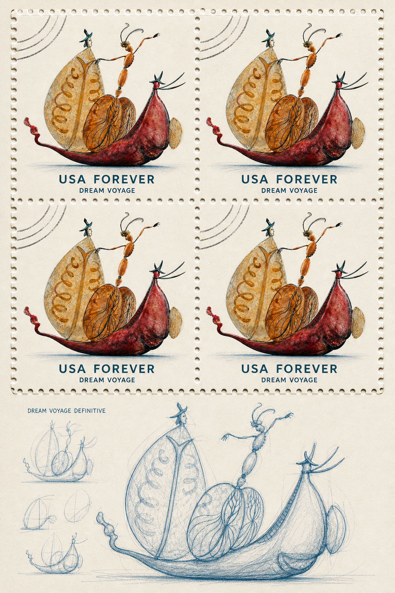
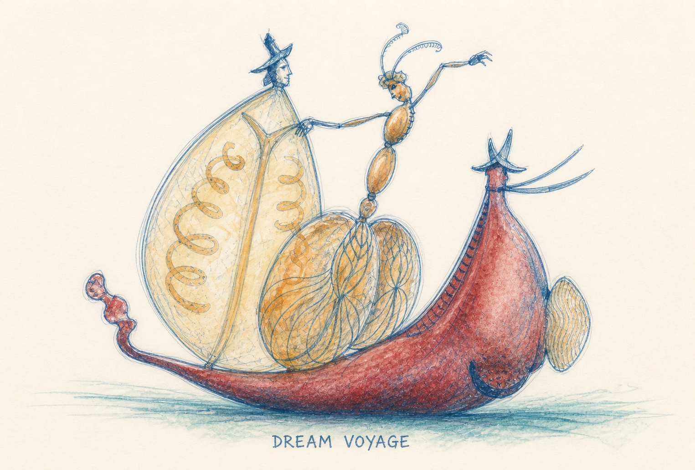
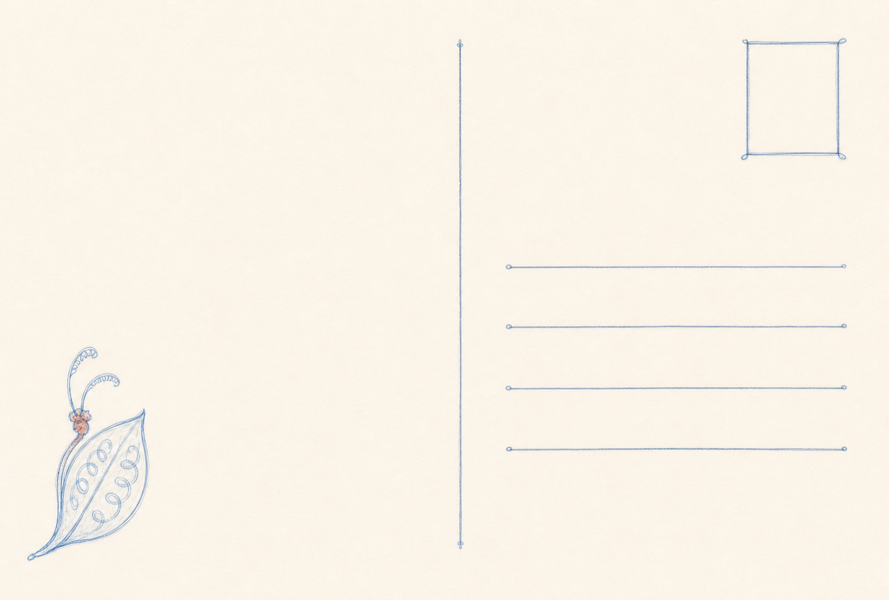
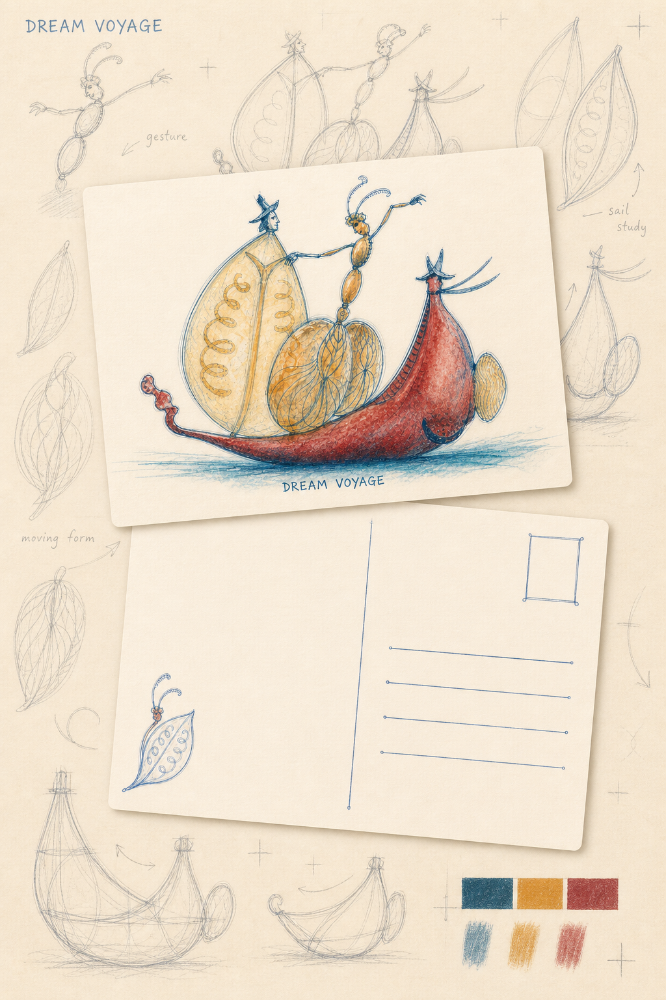
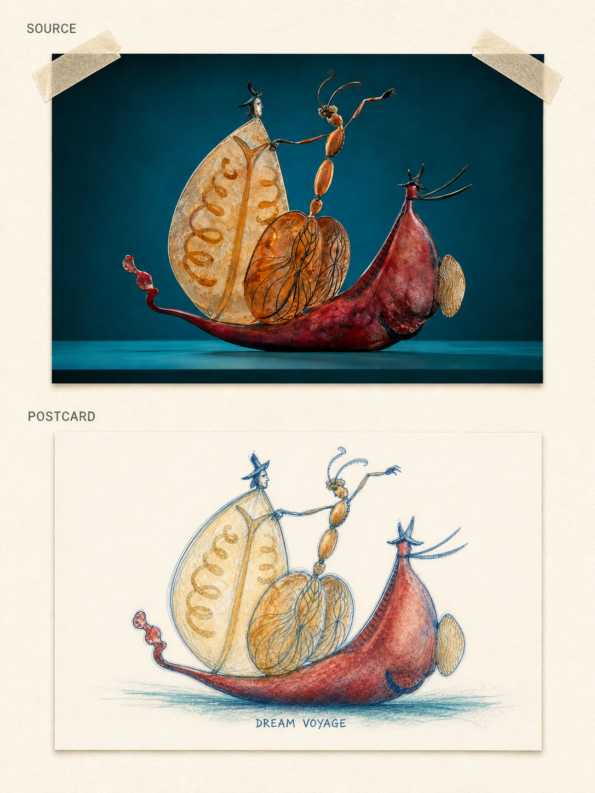

# Photo to Postage Stamp

将照片、场景描述或已有邮票转化为可收藏的邮票套装与诗意明信片。技能会根据主体、构图和情绪选择印刷风格，并生成完整的邮票版式、明信片正反面、设计展示海报和独立原图对比图。

## 案例：DREAM VOYAGE

本案例以一件幻想雕塑照片为视觉来源。原作由酒红色生物形船体、半透明琥珀叶片风帆、披斗篷人物与橙色昆虫形人物组成，背景为深青色。

设计没有虚构拍摄地点或日期。由于来源图片缺少可验证的国家信息，邮票采用技能规定的美国回退发行方式，并使用 `USA FOREVER`；主题名称统一为 `DREAM VOYAGE`。

### 设计方向

- 主风格：`SCHEME_BLUE_PENCIL_FIELD_SKETCH`
- 视觉命题：幻想航行的观察手稿
- 纸张：干净暖象牙白无涂布纸
- 线条：蓝灰色寻找线、淡石墨结构线、局部擦除痕迹与少量确定性深线
- 色彩：深青、琥珀、酒红，保留大面积纸张留白
- 主体锁定：保留船体、叶片风帆及三个人物之间的姿态和空间关系
- 邮票文字：`USA FOREVER`、`DREAM VOYAGE`
- 齿孔：完整的 `PUNCHED_HOLE_CONNECTOR_CUT` 圆孔与连接切口系统

## 邮票套装

### 1. 整合型纪念张

一枚纵向邮票直接从连续的主题画面中切出，邮票内外共享同一幅蓝铅笔观察图，不在背景中重复粘贴主体。

### 2. 四风格小版张

同一主体以四种兼容的印刷语言呈现：蓝铅笔田野速写、平涂手绘、清晰线冒险漫画和砖红色象形图。四枚邮票仍共享统一的纸张、配色与主题背景。

### 3. 重复普通票版张

上方为 `2 × 2` 重复邮票，下方保留独立的船体和风帆结构研究图，使成品兼具正式发行秩序与设计过程感。

## 明信片套装

### 正面

明信片正面采用横向 `148:100` 比例。它从原作重新构图，而不是放大邮票或直接套用照片；主体以蓝铅笔线和克制的透明色层呈现。

### 背面

背面与正面保持完全相同的尺寸和比例，包含分隔线、邮票框、四条地址线和一个由叶片风帆提炼的小型轮廓图案，并保留充足书写区域。

### 正反面设计展示海报

展示海报以完整且等尺寸的正反面卡片为主层，背景使用从手势草图到结构线稿的设计过程纸。卡片可以轻微旋转和叠放，但不得通过改变尺寸制造层级。

### 独立原图对比展示图

每套明信片额外输出一张独立对比展示图。本案例采用纵向 `3:4` 画幅和暖白 / 象牙白纸张背景；未经重绘的横版原照片置于上方，并以自然纸胶带固定，生成的明信片正面完整放置于下方。两者均保持原始比例，不拉伸、不裁切，也不使用商业化桌面道具。

## 本案例的完整交付物

1. 整合型纪念张
2. 四风格小版张
3. 重复普通票版张
4. 明信片正面
5. 明信片功能背面
6. 明信片正反面设计展示海报
7. 独立原图对比展示图

